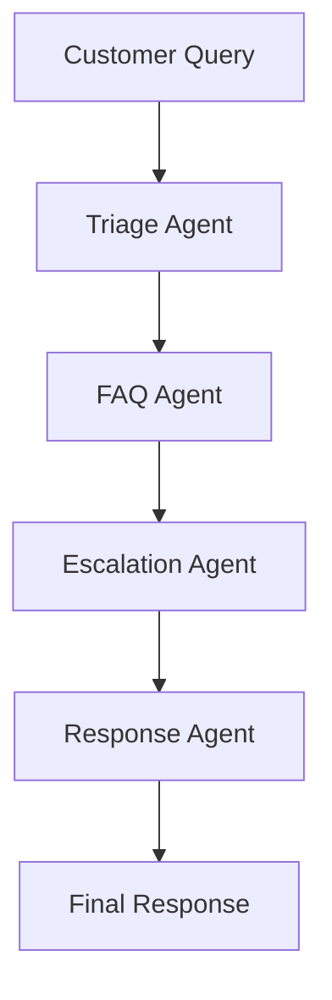
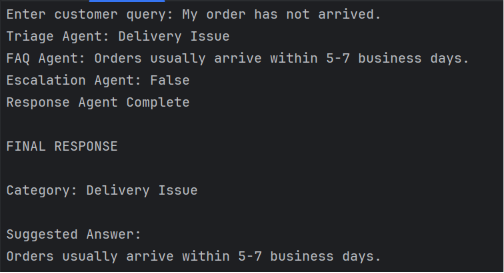
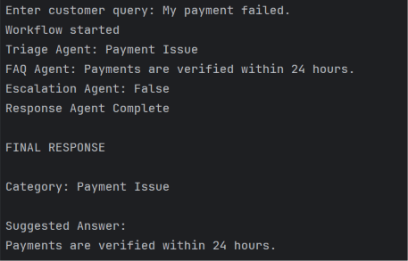
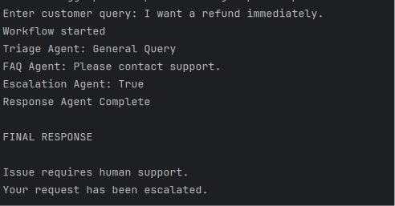

# Customer Support Multi-Agent Workflow using LangGraph

## Project Overview

This project implements a Multi-Agent Customer Support System using LangGraph.

The workflow consists of four specialized agents:

1. Triage Agent
2. FAQ Agent
3. Escalation Agent
4. Response Agent

Each agent performs a specific task and passes its output to the next agent.

## Workflow Diagram



## Agent Roles

### Triage Agent

Classifies the customer issue into categories such as Delivery Issue, Payment Issue, or General Query.

### FAQ Agent

Retrieves the appropriate FAQ response based on the identified category.

### Escalation Agent

Determines whether the issue requires human intervention.

### Response Agent

Generates the final customer response.

## Installation

```bash
pip install -r requirements.txt
```

## Run

```bash
python workflow.py
```

## Example Run 1

Input:
My order has not arrived.



## Example Run 2

Input:
My payment failed.



## Example Run 3

Input:
I want a refund immediately.



```
```
